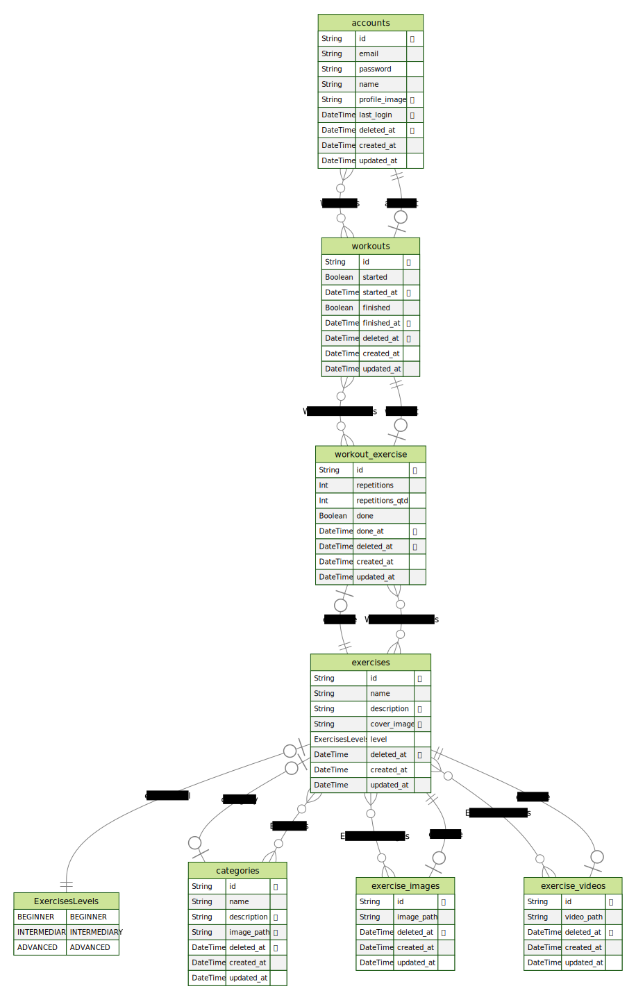

# Gym-app-api

  
  
  
  

API para controlar um aplicativo de Academia

## config

 - Fill the `.env` file like `.env.example`
 - Run `npm install` to install project dependencies
 - Run `npm run dev` to start development server

## Tools

 - [Express](https://expressjs.com/)
 - [Typescript](https://www.typescriptlang.org/)
 - [Node.js](https://nodejs.org/en/docs/)
 - [vscode](https://code.visualstudio.com/)
 - [TSyringe](https://github.com/Microsoft/tsyringe)
 - [Jest](https://jestjs.io/)

## database

 
